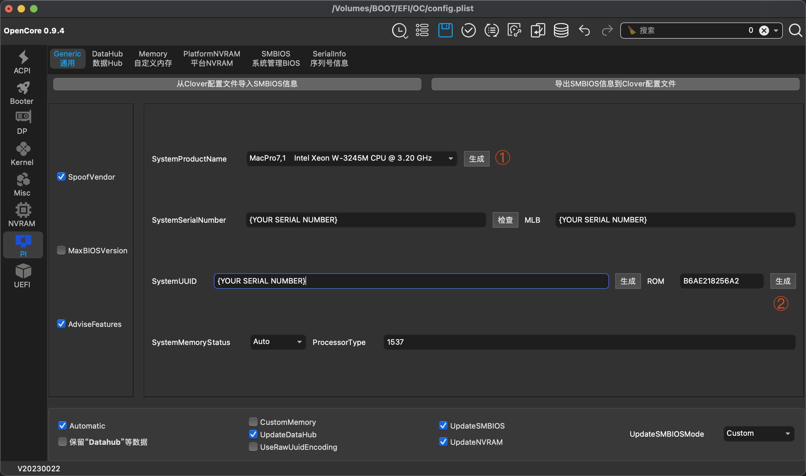

# Hackintosh-GIGABYTE-Z690I-AORUS-ULTRA-LITE

A guide for setting up Hackintosh on Z690I AORUS ULTRA LITE (rev. 1.0)

-----

## macOS

macOS Sonoma version 14.3.1

## Hardware List

| Component   | Specifications                        |
|------------|---------------------------------------|
| Processor  | Intel(R) i5-12400F                    |
| Motherboard| GIGABYTE Z690i AULTRA LITE (rev. 1.0) |
| Memory     | 32GB DDR5 5200MHz (16GB × 2)          |
| Graphics   | AMD Radeon RX 5700 XT (8GB / Sapphire)|
| Storage    | ZHITAI TiPlus5000 1TB (1024GB)        |
| Audio      | Realtek ALC4080                       |
| Ethernet   | Intel(R) Ethernet Controller 1225-V   |
| Wi-Fi      | Intel(R) Wi-Fi 6E AX211 160MHz        |
| Monitor    | 4K@144Hz miniLED                      |

## BIOS Settings:
version: F28

- **Tweaker**
    - Extreme Memory Profile (X.M.P) → Profile1
- **Tweaker → Advanced CPU Settings**
    - Hyper-Threading Technology → Enabled
    - All P-Cores and E-Cores → Enabled (Enable for CPUs with big.LITTLE architecture)
- **Settings → Platform Power → ErP**
    - Enabled 
- **Settings → IOPorts**
    - Above 4G Decoding → Enabled
    - Re-Size BAR Support → Enabled (Enable for RX6000 series) or it can be Disabled
- **Settings → IOPorts → Super IO Configuration** (if applicable)
    - Serial Port → Disabled
- **Settings → Miscellaneous**
    - VT-d → Enabled

## Bootable USB

- Download macOS installation image from a reliable source
- Use [BalenaEtcher](https://www.balena.io/etcher/) to create macOS installation bootable USB

## Pre-installation Configuration Adjustments

1. Download the latest `EFI` folder from the release page
2. Use [OCAT](https://github.com/ic005k/OCAuxiliaryTools) to open `EFI/OC/config.plist` (Refer to OCAT's basic configurations here)
3. Populate the model serial number:
   - Navigate to `PlatformInfo` → `Generic` → `MLB`
   - Enter your serial number (Generate if not prepared previously)
     
4. Modify CPU display name:
   - Navigate to `Nvram` → `Add` → `4D1FDA02-38C7-4A6A-9CC6-4BCCA8B30102` → `revcpuname`
   - Change the value of `revcpuname` to the desired display name, e.g. `Intel(R) Core(TM) i5-12400`
     
5. Enable big.LITTLE support (Determine based on your CPU, off by default):
   - Navigate to `Kernel` → `Quirks` → `ProvideCurrentCpulnfo`
   - Change the value of `ProvideCurrentCpulnfo` to `True` (Checkmark)
     

By this point, you should be able to replace the `EFI` folder in your USB (or HDD) and proceed to the installation interface (desktop).

## Post-Installation Adjustments (To be completed)
- Proper CPU frequency adjustment
- USB customization

