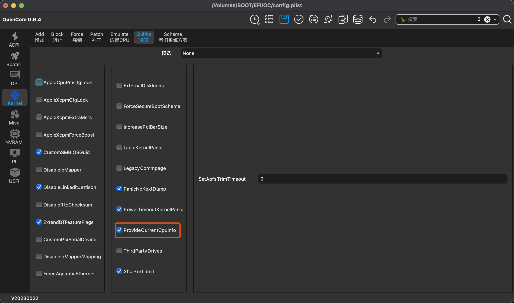

# Hackintosh-GIGABYTE-Z690I-AORUS-ULTRA-LITE

为 Z690I AORUS ULTRA LITE (rev. 1.0) 准备的黑苹果食用指南

-----

## macOS

macOS Sonoma 14.3.1 

## OpenCore

0.9.8

## Release 

每次 Release 时，会替换成随机三码，请自行生成

## 硬件列表

| 组件         | 规格                                    |
|--------------|-----------------------------------------|
| 处理器       | Intel(R) i5-13400ES                      |
| 主板         | 技嘉 Z690i AULTRA LITE (rev. 1.0)       |
| 内存         | 32GB DDR5 5200MHz (16GB × 2)            |
| 显卡         | AMD Radeon RX 5700 XT (8GB / 蓝宝石)     |
| 存储         | ZHITAI TiPlus5000 1TB (1024GB)           |
| 声卡         | Realtek ALC4080                         |
| 有线网卡     | Intel(R) Ethernet Controller 1225-V |
| 无线网卡     | Intel(R) Wi-Fi 6E AX211 160MHz          |
| 显示器       | 4K@144Hz miniLED                        |

## BIOS 设置：
version: F28

- **Tweaker**
    - Extreme Memory Profile (X.M.P) → Profile1
- **Tweaker → Advanced CPU Settings**
    - Hyper-Threading Technology → Enabled
    - All P-Cores and E-Cores → Enabled (大小核架构需开启)
- **Settings → Platform Power → ErP**
    - Enabled 
- **Settings → IOPorts**
    - Above 4G Decoding → Enabled
    - Re-Size BAR Support → Enabled (RX6000系列开启) or it can be Disabled
- **Settings → IOPorts → Super IO Configuration** (如果有)
    - Serial Port → Disabled
- **Settings → Miscellaneous**
    - VT-d → Enabled

## 引导U盘

- 从一个靠谱的地方下载 macOS 安装镜像 
- 使用 [BalenaEtcher](https://www.balena.io/etcher/) 制作 macOS 安装引导U盘  

## 安装前对config.plist进行一些调整

- 从 [release](https://github.com/Umenezumi/Hackintosh-GIGABYTE-Z690I-AORUS-ULTRA-LITE/releases) 页面下载最新的 `EFI` 文件夹  
- 使用 [OCAT](https://github.com/ic005k/OCAuxiliaryTools) 打开 `EFI/OC/config.plist`， [OCAT教程](https://github.com/5T33Z0/OC-Little-Translated/blob/main/D_Updating_OpenCore/README.md)  
- 填充机型序列号
    - 找到 `PlatformInfo` → `Generic` → `MLB` 
    - 填入序列号（如果事先没有准备，请点击图中相关按钮生成）
    
- 修改 CPU 展示型号
    - 找到 `Nvram` → `Add` → `4D1FDA02-38C7-4A6A-9CC6-4BCCA8B30102` → `revcpuname`  
    - 修改 `revcpuname` 的值为想要展示的信息，例如 `Intel(R) Core(TM) i5-12400`  
        
- 开启大小核支持（请根据具体使用的 CPU 判断，默认关闭）
    - 找到 `Kernel` → `Quirks` → `ProvideCurrentCpulnfo` 
    - 将 `ProvideCurrentCpulnfo` 的值改为 `True`(勾选)
    

至此不出意外的话，你已经可以替换U盘（硬盘）中的 `EFI` 文件夹进入安装界面（桌面）了

## 安装后需要调整的事项（待完善）
- 正确的 CPU 睿频
- USB 定制
